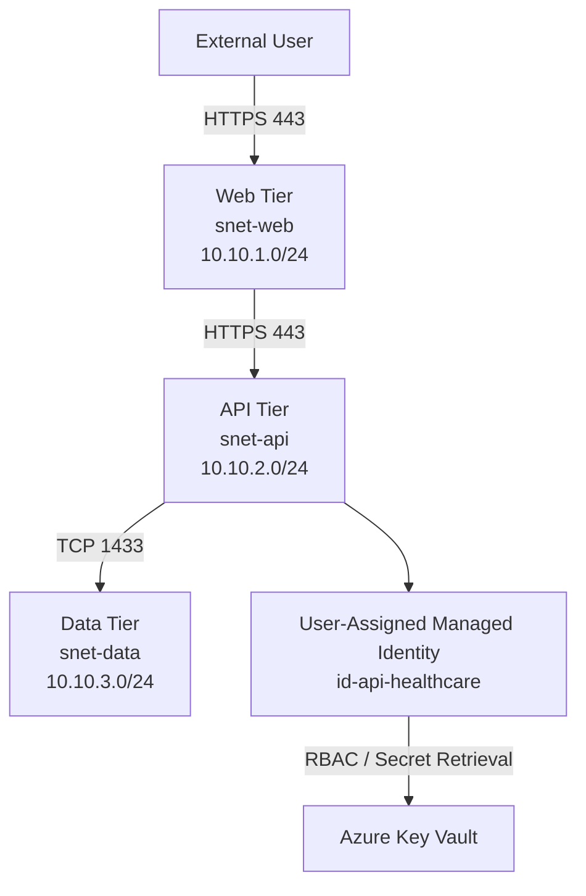

# Azure Healthcare Threat Modeling Lab

A hands-on Azure security architecture lab focused on threat modeling, STRIDE, network segmentation, identity, least privilege, and security posture review.

This project models a fictional healthcare application deployed in Microsoft Azure and applies security engineering practices to reduce architectural risk before production deployment.

## Project Goals

- Design a segmented three-tier Azure architecture
- Identify security trust boundaries and critical data flows
- Apply STRIDE threat modeling to application components and interactions
- Implement network segmentation with Azure Network Security Groups
- Protect application secrets using Azure Key Vault
- Use managed identities and least-privilege RBAC
- Document security findings and remediation activities
- Build a repeatable security review process aligned with enterprise security engineering

## Architecture



## Network Security

The application is segmented into separate Web, API, and Data subnets.

Custom Network Security Group rules restrict communication to required application flows:

| Source | Destination | Port | Action |
|---|---|---:|---|
| Internet | Web Tier | TCP 443 | Allow |
| Web Tier | API Tier | TCP 443 | Allow |
| API Tier | Data Tier | TCP 1433 | Allow |
| Other VNet traffic | Application tiers | Any | Deny |

This limits unnecessary east-west traffic and reduces lateral movement opportunities if one application tier is compromised.

## Identity and Secrets Management

Azure Key Vault is used to store application secrets rather than embedding credentials directly in application code.

The API tier uses the user-assigned managed identity:

`id-api-healthcare`

The identity is assigned:

`Key Vault Secrets User`

This allows the API workload to retrieve secrets without receiving secret-management or administrative permissions.

Administrative secret management is kept separate using:

`Key Vault Secrets Officer`

This demonstrates least privilege and separation of duties.

## Threat Modeling

The project applies the STRIDE framework across major trust boundaries:

- External User → Web Tier
- Web Tier → API Tier
- API Tier → Data Tier
- API Tier → Azure Key Vault
- Administrator → Azure Key Vault

STRIDE evaluates:

- Spoofing
- Tampering
- Repudiation
- Information Disclosure
- Denial of Service
- Elevation of Privilege

See:

[`threat-model/STRIDE.md`](threat-model/STRIDE.md)

## Security Posture Review

Security findings are tracked using the following lifecycle:

**Finding → Evidence → Risk → Recommendation → Owner → Remediation → Validation → Closure / Risk Acceptance**

Current findings include:

- Excessive east-west network access
- Broad Key Vault network exposure
- Hard-coded credential risk
- Excessive secret-management permissions
- Persistent privileged access
- Incomplete security telemetry

See:

[`security-review/risk-register.md`](security-review/risk-register.md)

## Azure Resources

Current lab resources include:

- Azure Virtual Network
- Web, API, and Data subnets
- Network Security Groups
- Azure Key Vault
- Microsoft.KeyVault service endpoint
- User-assigned managed identity
- Azure RBAC assignments

## Infrastructure as Code

The Azure architecture was first built and reviewed manually to understand the security controls, trust boundaries, and application data flows.

The environment was then translated into Terraform to make the design repeatable and easier to review as code.

The Terraform configuration includes:

- Resource group
- Virtual network
- Web, API, and Data subnets
- Network Security Groups
- Custom allow and deny rules
- Microsoft.KeyVault service endpoint
- User-assigned managed identity
- Azure Key Vault
- Log Analytics workspace
- Key Vault RBAC assignment
- Key Vault diagnostic settings

The Terraform configuration was initialized using the AzureRM provider and successfully validated with:

```text
terraform init
terraform validate
```

Validation result:

```text
Success! The configuration is valid.
```

The Terraform code is located in:

[`terraform/`](terraform/)

## Automated Security Review

A Python-based security review script analyzes the Terraform configuration for common architectural security concerns.

Current checks include:

- Broad inbound NSG rules
- Key Vault public network exposure
- Key Vault default-deny network ACLs
- Presence of a managed identity
- Least-privilege Key Vault RBAC
- Key Vault diagnostic logging
- Web-to-API segmentation
- API-to-Data segmentation

The review follows the same structure used during security posture assessments:

**Finding → Evidence → Risk → Recommendation**

Example result:

```text
[PASS] No unrestricted inbound allow rule to all ports detected.

AUTO-002 | MEDIUM | Key Vault public network endpoint enabled

Evidence:
public_network_access_enabled = true

Risk:
The Key Vault still exposes a public service endpoint.

Recommendation:
Evaluate Azure Private Endpoint and Private DNS for stronger network isolation.

RESULT: 1 security finding(s) detected.
```

The automation script is located at:

[`automation/security_review.py`](automation/security_review.py)

## CI/CD Security Validation

GitHub Actions is used to automatically validate infrastructure changes and run security checks whenever relevant Terraform or automation files are changed.

The workflow performs the following steps:

1. Checks out the repository
2. Configures Python
3. Runs the automated Terraform security review
4. Configures Terraform
5. Runs `terraform init`
6. Runs `terraform validate`

The workflow is triggered on pushes and pull requests that modify:

- `terraform/**`
- `automation/**`
- `.github/workflows/security-review.yml`

This creates a repeatable review process where infrastructure changes are checked before deployment.

Current workflow:

[`/.github/workflows/security-review.yml`](.github/workflows/security-review.yml)

The latest workflow run completed successfully.

## Planned Improvements

Future phases will include:

- Azure Private Endpoint for Key Vault
- Centralized logging with Log Analytics
- KQL security detection queries
- Microsoft Defender for Cloud
- Privileged Identity Management
- Infrastructure as Code using Terraform
- Automated security configuration checks
- CI/CD validation with GitHub Actions

## Repository Structure

```text
azure-healthcare-threat-model/
├── README.md
├── architecture/
│   └── README.md
├── threat-model/
│   └── STRIDE.md
├── security-review/
│   └── risk-register.md
├── terraform/
└── automation/
```

## Security Engineering Concepts Demonstrated

This project demonstrates hands-on experience with:

- Threat modeling
- STRIDE
- Data flow analysis
- Trust boundaries
- Zero Trust principles
- Network segmentation
- Defense in depth
- Least privilege
- Managed identities
- RBAC
- Secrets management
- Security posture reviews
- Risk documentation
- Remediation tracking
